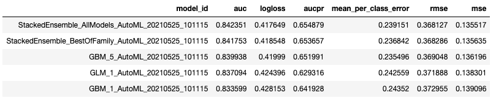

# AutoML in Cloudera Machine Learning
The following step-by-step instructions will help you get up and running with AuotML in Cloudera Machine Learning (CML). To learn more about CML, view our **[documentation](https://docs.cloudera.com/machine-learning/cloud/index.html)**

### 0. AutoML Overview
In the following example, we show how CML can be used to build an end-to-end Churn prediction project:
https://github.com/cloudera/CML_AMP_Churn_Prediction

The most complicated part of the project is defining our pipeline, which defines the steps necessary to prepare the data and train the model
```
pipe = Pipeline([("ct", ct), ("scaler", StandardScaler()), ("clf", clf)])
```
In this case, we perform One Hot Encoding to convert character variables to their numeric equivalent, standardize the numeric data, and then train a Logistic Regression. This is all for one model. What if we want to train additional models across various parameter configurations to identify the best model? Imagine how complicated this can get!

AutoML libraries, such as **[H2O](https://docs.h2o.ai/h2o/latest-stable/h2o-docs/automl.html)** and **[auto-sklearn](https://automl.github.io/auto-sklearn/master/)**, allowing you to simply define your target and predictor variables, and takes care of the rest on the back end.

### 0. Install Dependencies
The [`requirements.txt`](https://github.com/kramer003/AutoML-in-Cloudera-Machine-Learning/blob/main/requirements.txt) file installs dependencies to your CML environment when it starts up. CML comes pre-packaged with common packages such as Pandas and Scikit-learn, we will need to add the `h2o` library to this file. To ensure reproducability, be sure to specify the version of the h2o library you with to install. The most recent h2o verison can be found **[here](https://pypi.org/project/h2o/)**:

#### Example:
```h2o==3.32.1.3```

### 2. Model Building
The [`1_model_building.py`](https://github.com/kramer003/AutoML-in-Cloudera-Machine-Learning/blob/main/code/1_model_building.py) file walks you through the steps of using H2O AutoML.

The Python variable `aml` contains the leaderboard of all models built, and their respective results. In this case the best model is a Stacked Ensemble.

```
aml.leaderboard
```


At the end of the script, we use `h2o.save_model` to save the state of our Stacked Ensemble model, and use it to generate predictions on new data.

```
h2o.save_model(model=aml.leader, path=os.path.realpath('.')+'/models, force=True)
```

### 2. Real-time Predictions
The [`2_real_time_predicitons.py`](https://github.com/kramer003/AutoML-in-Cloudera-Machine-Learning/blob/main/code/2_real_time_predictions.py) file deploys our Stacked Ensemble as a REST API Endpoint for real-time scoring

### 3. Batch Predictions.
The [`3_batch_predictions.py`](https://github.com/kramer003/AutoML-in-Cloudera-Machine-Learning/blob/main/code/3_batch_predictions.py)

### 4. Conclusion
This quick guide helps you get up and running with H2O AutoML in CML. If you have additional quesitons, don't hesistate to reach us on the **[Cloudera Community](https://community.cloudera.com/)**.
