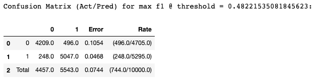
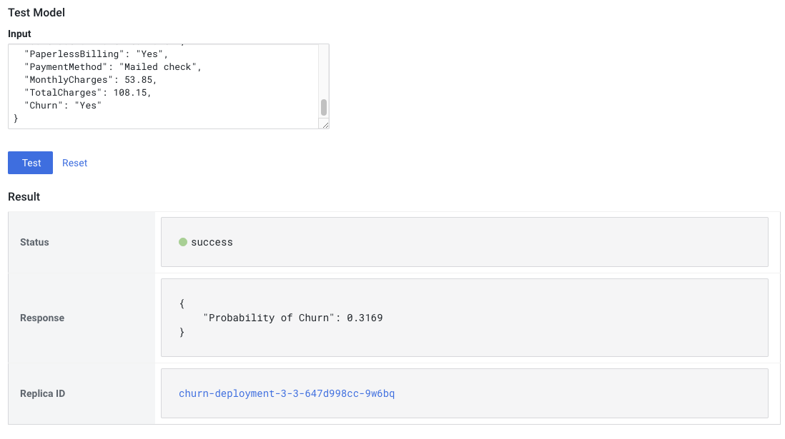
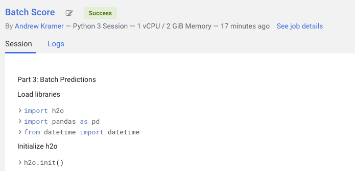

# AutoML in Cloudera Machine Learning
The following step-by-step instructions will help you get up and running with AuotML in Cloudera Machine Learning (CML). To learn more about CML, view our **[documentation](https://docs.cloudera.com/machine-learning/cloud/index.html)**

### AutoML Overview
In the following example, we show how CML can be used to build an end-to-end Churn prediction project:
https://github.com/cloudera/CML_AMP_Churn_Prediction

The most complicated part of the project is defining our pipeline, which defines the steps necessary to prepare the data and train the model
```
pipe = Pipeline([("ct", ct), ("scaler", StandardScaler()), ("clf", clf)])
```
In this case, we perform One Hot Encoding to convert character variables to their numeric equivalent, standardize the numeric data, and then train a Logistic Regression. This is all for one model. What if we want to train additional models across various parameter configurations to identify the best model? Imagine how complicated this can get!

AutoML libraries, such as **[H2O](https://docs.h2o.ai/h2o/latest-stable/h2o-docs/automl.html)** and **[auto-sklearn](https://automl.github.io/auto-sklearn/master/)**, allowing you to simply define your target and predictor variables, and takes care of the rest on the back end.

### 0. Install Dependencies
The [`requirements.txt`](https://github.com/kramer003/AutoML-in-Cloudera-Machine-Learning/blob/main/requirements.txt) file installs dependencies to your CML environment when it starts up. CML comes pre-packaged with common packages such as Pandas and Scikit-learn, we will need to add the `h2o` library to this file. To ensure reproducability, be sure to specify the version of the h2o library you with to install. The most recent h2o verison can be found **[here](https://pypi.org/project/h2o/)**:

#### Example:
```h2o==3.32.1.3```

### 1. Model Building
The [`1_model_building.py`](https://github.com/kramer003/AutoML-in-Cloudera-Machine-Learning/blob/main/code/1_model_building.py) file walks you through the steps of using H2O AutoML. It is best to use a **[session](https://docs.cloudera.com/machine-learning/cloud/projects/topics/ml-workbench.html)** with CML's built in notebooks to interactively run the code and interpret the output.

The Python variable `auto_ml` contains the leaderboard of all models built, and their respective results. In this case the best model is a Stacked Ensemble.

```
auto_ml.leaderboard
```


`auto_ml` also contains more detailed information on the best model. Among the model details returned is the Confusion Matrix. If you want just the confusion matrix, you can run `auto_ml.leader.confusion_matrix`

```
auto_ml.leader
```


At the end of the script, we use `h2o.save_model` to save the state of our Stacked Ensemble model, and use it to generate predictions on new data.

```
h2o.save_model(model=aml.leader, path=os.path.realpath('.') + '/models', force=True)
```

Note the path of the saved model as you will need it for step #2 and #3. You may use the default model that comes with this example, which would require no code changes. Your actual model name may be slightly different.

`'/home/cdsw/models/StackedEnsemble_AllModels_AutoML_20210525_151323'`

### 2. Real-time Predictions
The [`2_real_time_predicitons.py`](https://github.com/kramer003/AutoML-in-Cloudera-Machine-Learning/blob/main/code/2_real_time_predictions.py) file deploys our Stacked Ensemble as a REST API Endpoint for real-time scoring. This works best for single record predictions when a response is needed very quickly.

In the following line, replace the default model name with the model you created, in this case `SackedEnsemble_AllModels_AutoML_20210525_151323`
```
aml_model = h2o.load_model('models/StackedEnsemble_AllModels_AutoML_20210525_151323')
```

Next, we will click on the **[Models](https://docs.cloudera.com/machine-learning/cloud/models/topics/ml-creating-and-deploying-a-model.html)** feature to generate real-time predictions via REST API. To deploy the model, click on *New Model* with the following configuration:
* **Name**: AutoML Model API Endpoint
* **Description**: Using H2O to predict churn
* **File**: 2_real_time_predictions.py
* **Function**: predict
* **Input**:

```
{
	"customerID": "3668-QPYBK",
	 "gender": "Male",
	 "SeniorCitizen": 0,
	 "Partner": "No",
	 "Dependents": "No",
	 "tenure": 2,
	 "PhoneService": "Yes",
	 "MultipleLines": "No",
	 "InternetService": "DSL",
	 "OnlineSecurity": "Yes",
	 "OnlineBackup": "Yes",
	 "DeviceProtection": "No",
	 "TechSupport": "No",
	 "StreamingTV": "No",
	 "StreamingMovies": "No",
	 "Contract": "Month-to-month",
	 "PaperlessBilling": "Yes",
	 "PaymentMethod": "Mailed check",
	 "MonthlyCharges": 53.85,
	 "TotalCharges": 108.15,
	 "Churn": "Yes"
}
```

Once the model is deployed, we can test the model API and get a real-time resopnse. We can now integrate this endpoint into any system that speaks REST.


### 3. Batch Predictions.
The [`3_batch_predictions.py`](https://github.com/kramer003/AutoML-in-Cloudera-Machine-Learning/blob/main/code/3_batch_predictions.py) file can be used to deploy the model in a batch setting. This works best when scoring multiple records on a set frequency, ie hourly, weekly, daily, etc. Typically, we do not need an instant response as the process runs in the back end.


In the following line, replace the default model name with the model you created, in this case `SackedEnsemble_AllModels_AutoML_20210525_151323`
```
aml_model = h2o.load_model('models/StackedEnsemble_AllModels_AutoML_20210525_151323')
```

We will click on the **[Jobs](https://docs.cloudera.com/machine-learning/cloud/jobs-pipelines/topics/ml-creating-a-job.html)** feature in order to schedule this script to run on-demand. Use the following configurations.
* **Name**: Batch Scoring
* **Script**: 3_batch_predictions.py
* **Schedule**: Manual

To run the job, go to **Jobs** and under **Actions**, click **Run** for your model. You will be able to inspect your run and see that it was sucessful.



### 4. Conclusion
This quick guide helps you get up and running with H2O AutoML in CML. To learn more about all of CML's features, check out the **[Product Overview](https://docs.cloudera.com/machine-learning/cloud/product/topics/ml-product-overview.html)**.  If you have quesitons, don't hesistate to reach us on the **[Cloudera Community](https://community.cloudera.com/)**.
